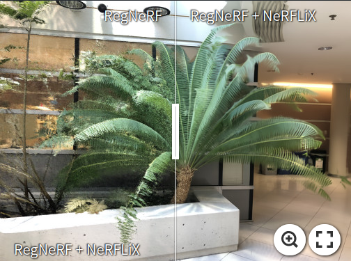
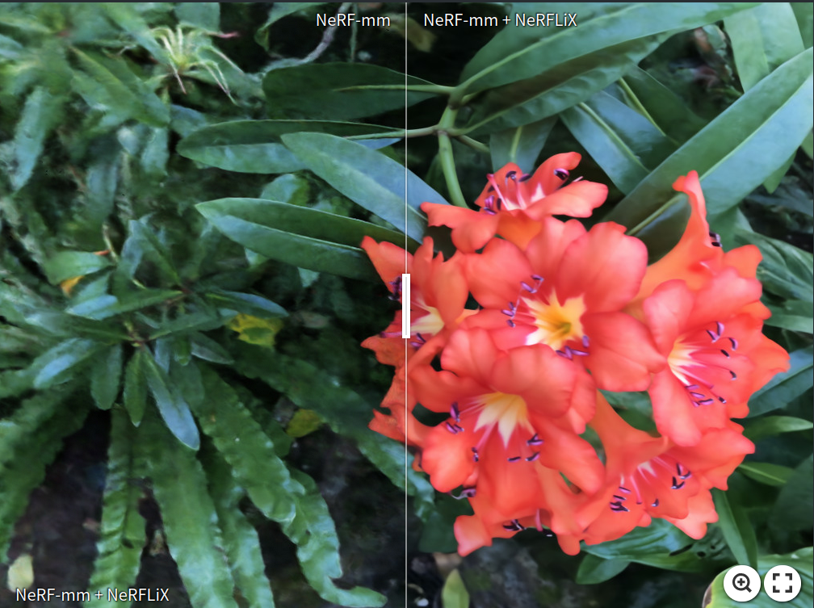
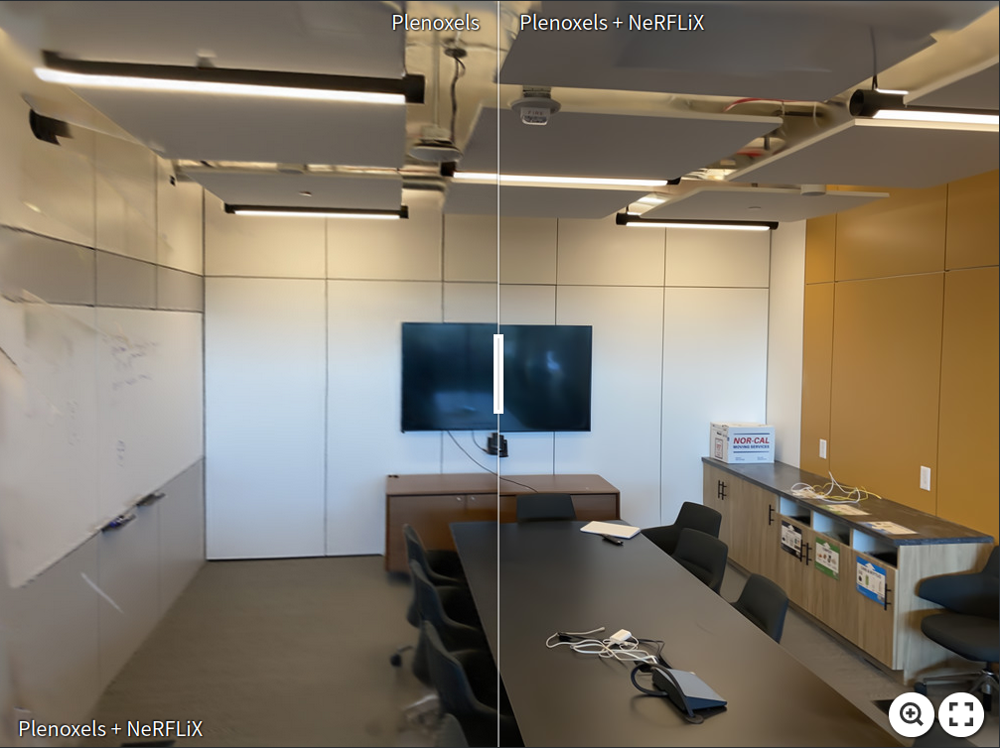
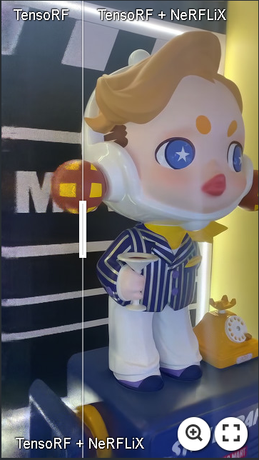
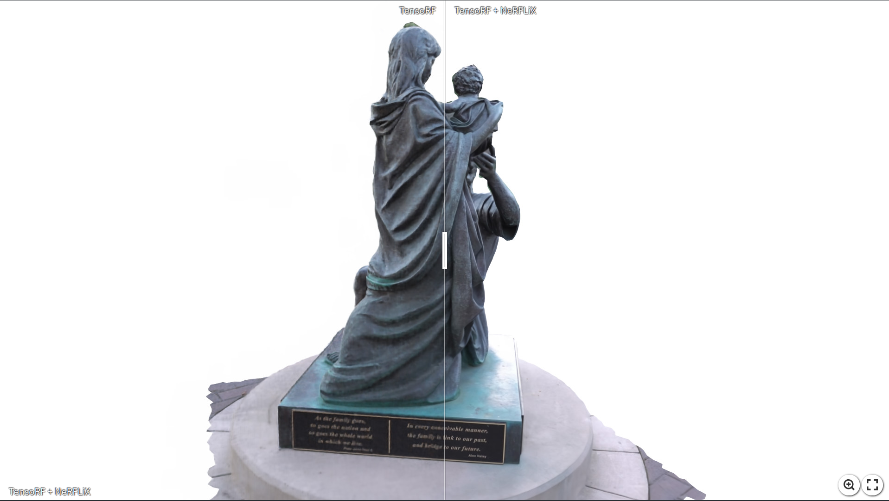
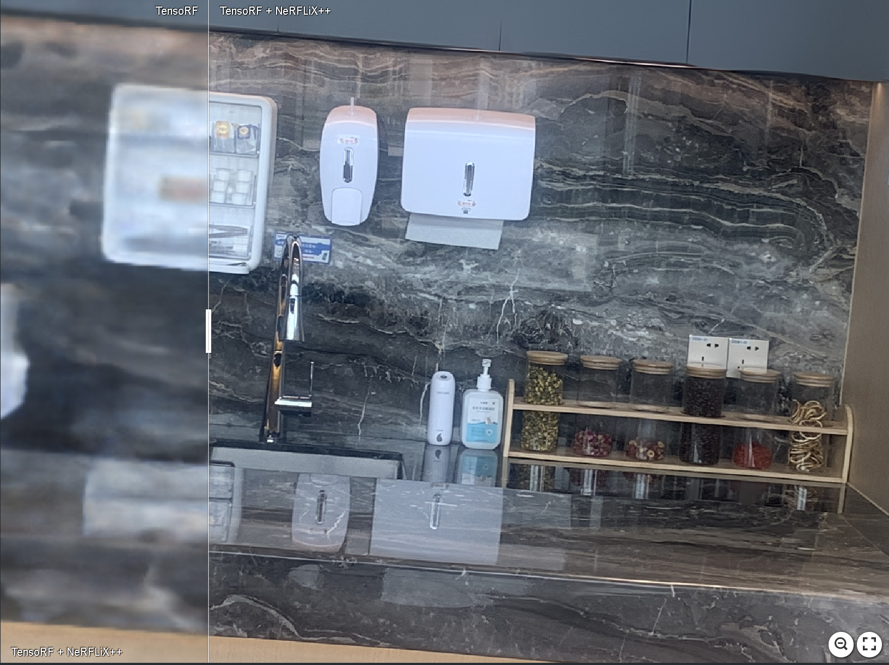
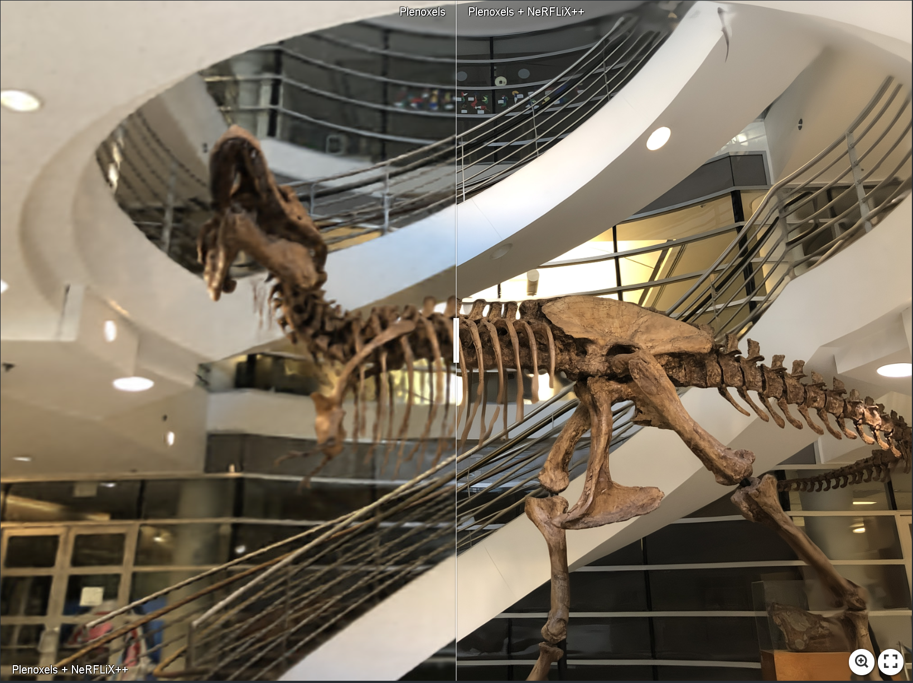
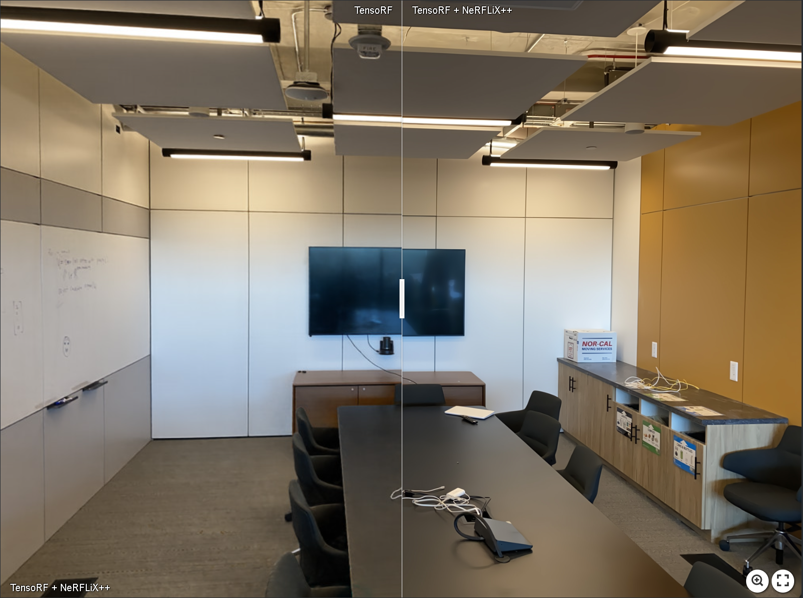
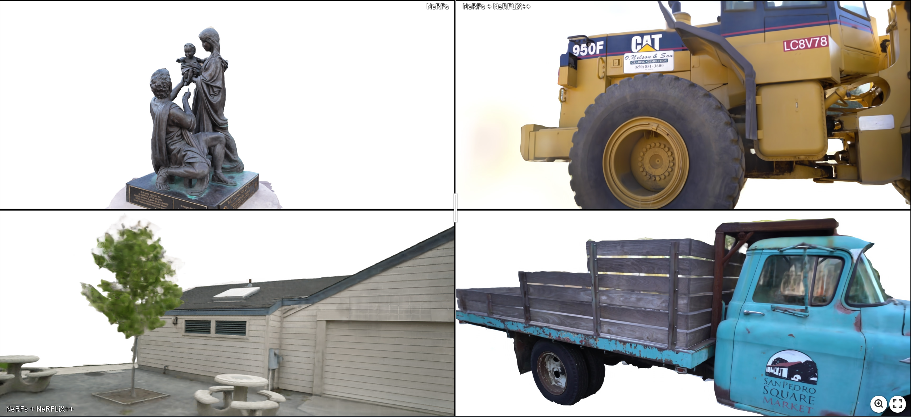

# NeRFLiX: High-Quality Neural View Synthesis by Learning a Degradation-Driven Inter-viewpoint MiXer (CVPR2023)

#### Kun Zhou, Wenbo Li, Yi Wang, Tao Hu, Nianjuan Jiang, Xiaoguang Han, Jiangbo Lu

#### [\[Paper\]](https://openaccess.thecvf.com/content/CVPR2023/papers/Zhou_NeRFLix_High-Quality_Neural_View_Synthesis_by_Learning_a_Degradation-Driven_Inter-Viewpoint_CVPR_2023_paper.pdf) [\[Project\]](https://t.co/uNiTd9ujCv)
---

This is the official implementation of NeRFLiX. 

# News
 Our recent work [NeRFLiX++](https://arxiv.org/abs/2306.06388), an improved version that is stronger, faster and for 4K NeRFs. We will release the source code later.
  </br>The [project website](https://redrock303.github.io/nerflix_plus) is now available.

### Some enhanced results

[](https://imgsli.com/MTg1ODI1) [](https://imgsli.com/MTg1ODQx)[](https://imgsli.com/MTg1ODQy) [](https://imgsli.com/MTg1ODQ1)

[](https://imgsli.com/MTg1ODQz)
'''
# Inference  
LLFF /Tanks
``` sh
# python test_llff_tensorRF/test_tankandtemple_tensorRF.py [ pretrained_weights | view_selection json file | nerf rendered test view |enhanced_result_path ] 

```

 I also give a simple script about how to enhance novel views by nerf model. The pre-trained model and some josn files are avaliable at [google drive](https://drive.google.com/drive/folders/1NcK8_DoUnUcud7C0qP56LrKjPp4A0CYW?usp=sharing)
  </br>
  &ensp; step 1 : perpare a trained NeRF model on a 3D scene [training images and training poses]
   </br>
  &ensp; step 2 : utilize this NeRF model to render novel views(images) given a set of novel camera poses
   </br>
  &ensp; step 3 : run '[pose_matching.py](./inference/pose_matching.py)' by given four necessary inputs:
        (1) training images (2) training camera poses (3) novel images (4) novel camera poses
        after that , you will get the view selection results saved in a josn file 
   </br>
  &ensp; step 4 : run the '[test_novelviews.py](./inference/test_novelviews.py)' , then the enhanced views will be placed in the result_path
   </br>
  Also you can train an in-the-wild scene using SOTA NeRF approaches and enjoy the photo-relastic results by NeRFLiX.


 # Training 
 I put the training code in the train folder.
 </br> 
 &ensp;you should download the vimeo_septuplet and eight LLFF-T scenes(drop every eighth frame)
 </br>
 &ensp;then simple run the following commend using single or multiple GPUs
 ```sh
 python3 -m torch.distributed.launch --nproc_per_node=gpu_number --master_port=port_code $(dirname $0)/train.py
 ```


## Some high-resolution enhanced results of NeRFLiX++
[](https://imgsli.com/MTg2MTE1)
[](https://imgsli.com/MTg1ODYy)
[](https://imgsli.com/MTg1ODYz)
[](https://imgsli.com/MTg1ODYw)


 We also upload a video demo at [YouTube](https://youtu.be/YiXvgQXiWII).

 
 ### Citation
If our work is useful for your research, please consider citing:

    @inproceedings{zhou2023nerflix,
    title={NeRFLiX: High-Quality Neural View Synthesis by Learning a Degradation-Driven Inter-viewpoint MiXer},
    author={Zhou, Kun and Li, Wenbo and Wang, Yi and Hu, Tao and Jiang, Nianjuan and Han, Xiaoguang and Lu, Jiangbo},
    booktitle={Proceedings of the IEEE/CVF Conference on Computer Vision and Pattern Recognition},
    pages={12363--12374},
    year={2023}
    }


    @article{zhou2023nerflix,
    title={From NeRFLiX to NeRFLiX++: A General NeRF-Agnostic Restorer Paradigm},
    author={Zhou, Kun and Li, Wenbo and Jiang, Nianjuan and Han, Xiaoguang and Lu, Jiangbo},
    journal={arXiv preprint arXiv:2306.06388},
    year={2023}
    }

---
